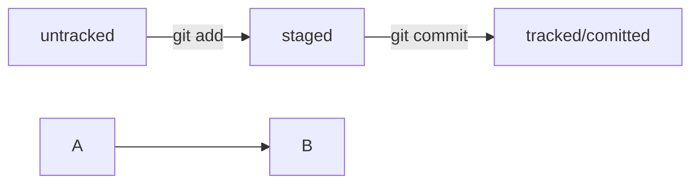

# Cheatsheet

## SSH

| Description | Command | 
|---|---|
| Check existing SSH keys |```cd ~ & ls -la .ssh/```|
| Generate SSH key (ed25519) | ```ssh-keygen -t ed25519 -C "email@example.com"``` |
| Generate SSH key (rsa) | ```ssh-keygen -t rsa -b 4096 -C "email@example.com"``` | |
| Copy public SSH key to clipboard | ```pbcopy < ~/.ssh/id_ed25519.pub``` |
| Copy public SSH key manually | ```cat ~/.ssh/id_ed25519.pub``` |

## Git

| Description | Command | 
|---|---|
| Init local repository | ```git init``` |
| Track file | ```git add <filename> ``` |
| Track multiple files | ```git add --all``` |
| Track entire folder | ```git add .``` |
| Add remote repo | ```git remote add origin <repo_url>``` |
| Add commit | ```git commit -m "Commit message"``` |
| Push **_first_** commit to remote repo | ```git push -u origin main``` |
| Push changes to remote repo | ```git push origin main``` |
| View repository status | ```git status``` |
| View commits history | ```git log``` |
| View shortened commits history | ```git log --oneline``` |
| Quit from log | Press "Q" on a keyboard |
| Edit last commit (HEAD)| Make changes (e.g. ```git add <missed file>```) and then ```git commit --amend --no-edit``` |
| Edit last commit's message | ```git commit --amend -m "Edited message"``` |


**File states**

