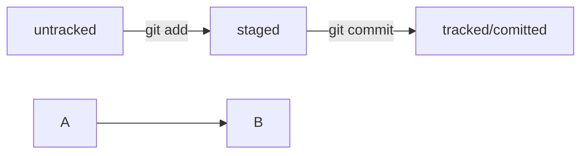

# Git Cheatsheet

## Commands

### SSH

**Check existing SSH keys**
```
cd ~
ls -la .ssh/
```

**Generate SSH key**
```
ssh-keygen -t ed25519 -C "email@example.com"
```
or
```
ssh-keygen -t rsa -b 4096 -C "email@example.com"
```

**Copy public SSH key**
```
pbcopy < ~/.ssh/id_rsa.pub
```
or
```
pbcopy < ~/.ssh/id_ed25519.pub
```
or manually
```
cat ~/.ssh/id_ed25519.pub
```

### Git

**Init local repository**
```
git init
```

**Track file**
```
git add <filename> 
```

**Track multiple files**
```
git add --all
```

**Track entire folder**
```
git add .
```

**Add remote repo**
```
git remote add origin <repo_url>
```

**Add commit**
```
git commit -m "Commit message"
```

**Push first commit**
```
git push -u origin main
```

**Push **_first_** commit to remote repo**
```
git push -u origin main
```

**Push changes to remote repo**
```
git push origin main
```

**View repository status**
```
git status
```

**View commits history**
```
git log
```
**View shortened commits history**
```
git log --oneline
```
**Quit from log** – _press "Q" on a keyboard_

**File states**
